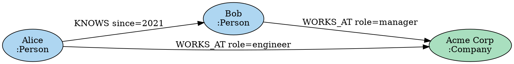

# DOT / SVG エクスポート

MaharitDB は `maharit-viz` クレートを通じて、グラフを Graphviz の DOT 形式および SVG 形式でエクスポートできます。

## DOT 形式のエクスポート

DOT 形式は Graphviz で可視化できる標準的なグラフ記述言語です。

### Cypher からのエクスポート

```cypher
-- グラフ全体を DOT 形式で出力
CALL db.export.dot()
YIELD dot_string
RETURN dot_string

-- 特定のサブグラフをエクスポート
MATCH (p:Person)-[:KNOWS]->(f:Person)
WHERE p.name = "Alice"
CALL db.export.subgraph.dot(collect(p) + collect(f))
YIELD dot_string
RETURN dot_string
```

### Rust API からのエクスポート

```rust
use maharit_viz::dot::DotExporter;
use maharit_core::Graph;
use std::fs;

fn main() -> Result<(), Box<dyn std::error::Error>> {
    let graph = Graph::new(); // グラフを構築...

    let exporter = DotExporter::new()
        .with_node_label("name")           // ノードのラベルに使うプロパティ
        .with_edge_label("type")           // エッジのラベルに使うプロパティ
        .with_node_color_by_label(true)    // ラベルで色分け
        .with_directed(true);             // 有向グラフ

    let dot = exporter.export(&graph)?;

    // ファイルに保存
    fs::write("graph.dot", &dot)?;
    println!("Exported to graph.dot");

    Ok(())
}
```

### DOT ファイルの例



### Graphviz でのレンダリング

```bash
# PNG に変換
dot -Tpng graph.dot -o graph.png

# SVG に変換
dot -Tsvg graph.dot -o graph.svg

# PDF に変換
dot -Tpdf graph.dot -o graph.pdf

# 異なるレイアウトエンジンを使用
neato -Tsvg graph.dot -o graph_neato.svg  # 力学モデル
circo -Tsvg graph.dot -o graph_circo.svg  # 円形
```

## SVG エクスポート

MaharitDB は Graphviz なしで直接 SVG を生成できます。力学モデルレイアウト（Force-directed layout）を使用してノードを配置します。

### Rust API からの SVG エクスポート

```rust
use maharit_viz::svg::SvgExporter;

fn main() -> Result<(), Box<dyn std::error::Error>> {
    let graph = Graph::new(); // グラフを構築...

    let exporter = SvgExporter::new()
        .with_width(1200)
        .with_height(800)
        .with_node_radius(20)
        .with_node_label("name")
        .with_force_iterations(500)  // 力学モデルの反復回数
        .with_spring_length(100.0)   // バネ定数
        .with_repulsion(1000.0);     // 反発力

    let svg = exporter.export(&graph)?;

    std::fs::write("graph.svg", &svg)?;
    println!("SVG exported to graph.svg");

    Ok(())
}
```

### SVG のカスタマイズ

```rust
let exporter = SvgExporter::new()
    // 色の設定
    .with_label_color("Person", "#3498DB")
    .with_label_color("Company", "#2ECC71")
    .with_edge_color("KNOWS", "#E74C3C")
    // フォントの設定
    .with_font_size(12)
    .with_font_family("Arial, sans-serif")
    // スタイルの設定
    .with_node_stroke("#2C3E50")
    .with_node_stroke_width(2);
```

## インタラクティブ SVG

生成された SVG にはインタラクティブな機能を追加できます：

```rust
let exporter = SvgExporter::new()
    .with_interactive(true)     // クリックでノード情報を表示
    .with_zoom_enabled(true)    // マウスホイールでズーム
    .with_pan_enabled(true);    // ドラッグでパン
```

## JSON エクスポート（可視化ライブラリ向け）

D3.js や Vis.js などのブラウザ側の可視化ライブラリと連携するための JSON 形式でエクスポートできます。

```cypher
CALL db.export.json()
YIELD json_string
RETURN json_string
```

出力形式（D3.js 互換）：

```json
{
  "nodes": [
    {"id": 1, "label": "Alice", "labels": ["Person"], "properties": {"name": "Alice", "age": 30}},
    {"id": 2, "label": "Bob", "labels": ["Person"], "properties": {"name": "Bob", "age": 25}}
  ],
  "links": [
    {"source": 1, "target": 2, "type": "KNOWS", "properties": {"since": 2021}}
  ]
}
```

## サブグラフのエクスポート

大規模グラフの場合、特定のサブグラフだけをエクスポートします。

```rust
use maharit_viz::dot::DotExporter;

// 特定のノード群だけをエクスポート
let node_ids = vec![1, 2, 3, 4, 5];
let dot = DotExporter::new()
    .export_subgraph(&graph, &node_ids)?;
```
