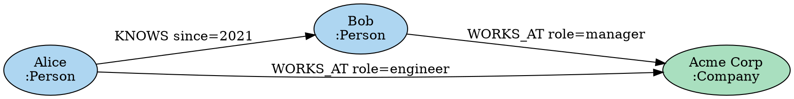

# DOT / SVG エクスポート

MaharitDB は `maharit-viz` クレートを通じて、グラフを Graphviz の DOT 形式および SVG 形式でエクスポートできます。

## DOT 形式のエクスポート

DOT 形式は Graphviz で可視化できる標準的なグラフ記述言語です。

### Cypher からのエクスポート

```cypher
-- グラフ全体を DOT 形式で出力
CALL db.export.dot()
YIELD dot_string
RETURN dot_string

-- 特定のサブグラフをエクスポート
MATCH (p:Person)-[:KNOWS]->(f:Person)
WHERE p.name = "Alice"
CALL db.export.subgraph.dot(collect(p) + collect(f))
YIELD dot_string
RETURN dot_string
```

### Rust API からのエクスポート

```rust
use maharit_viz::dot::{DotExporter, DotStyle};
use maharit_core::Graph;
use std::fs;

fn main() -> std::io::Result<()> {
    let graph = Graph::new(); // グラフを構築...

    // デフォルトスタイルでエクスポート（静的メソッド）
    let dot = DotExporter::export(&graph);

    // ファイルに保存
    fs::write("graph.dot", &dot)?;
    println!("Exported to graph.dot");

    Ok(())
}
```

スタイルをカスタマイズする場合は `DotStyle` を構築して `export_with_style` を使用します：

```rust
use maharit_viz::dot::{DotExporter, DotStyle};
use maharit_core::Graph;

fn main() -> std::io::Result<()> {
    let graph = Graph::new(); // グラフを構築...

    let style = DotStyle {
        top_to_bottom: false,    // 左から右に描画
        node_shape: "box".to_string(),
        node_color: "lightyellow".to_string(),
        edge_color: "black".to_string(),
        show_properties: true,
        max_properties: 5,
    };

    let dot = DotExporter::export_with_style(&graph, &style);
    std::fs::write("graph.dot", &dot)?;

    Ok(())
}
```

### DOT ファイルの例



### Graphviz でのレンダリング

```bash
# PNG に変換
dot -Tpng graph.dot -o graph.png

# SVG に変換
dot -Tsvg graph.dot -o graph.svg

# PDF に変換
dot -Tpdf graph.dot -o graph.pdf

# 異なるレイアウトエンジンを使用
neato -Tsvg graph.dot -o graph_neato.svg  # 力学モデル
circo -Tsvg graph.dot -o graph_circo.svg  # 円形
```

## SVG エクスポート

MaharitDB は Graphviz なしで直接 SVG を生成できます。力学モデルレイアウト（Force-directed layout）を使用してノードを配置します。

### Rust API からの SVG エクスポート

```rust
use maharit_viz::svg::{SvgExporter, ForceDirectedLayout};
use maharit_core::Graph;

fn main() -> std::io::Result<()> {
    let graph = Graph::new(); // グラフを構築...

    // デフォルト設定でエクスポート
    let exporter = SvgExporter::default();
    let svg = exporter.export(&graph);

    std::fs::write("graph.svg", &svg)?;
    println!("SVG exported to graph.svg");

    Ok(())
}
```

### SVG のカスタマイズ

`SvgExporter` と `ForceDirectedLayout` のフィールドを直接設定してカスタマイズします：

```rust
use maharit_viz::svg::{SvgExporter, ForceDirectedLayout};
use maharit_core::Graph;

fn main() -> std::io::Result<()> {
    let graph = Graph::new(); // グラフを構築...

    let exporter = SvgExporter {
        layout: ForceDirectedLayout {
            iterations: 300,        // 反復回数を増やして安定したレイアウトに
            repulsion: 1000.0,      // ノード間の反発力
            attraction: 0.05,       // エッジの引力
            damping: 0.9,           // 速度の減衰係数
            canvas_width: 1200.0,   // キャンバス幅（ピクセル）
            canvas_height: 900.0,   // キャンバス高さ（ピクセル）
        },
        node_radius: 25.0,
        node_color: "#3498DB".to_string(),
        edge_color: "#E74C3C".to_string(),
        font_size: 14.0,
    };

    // ファイルに直接書き出す
    exporter.export_to_file(&graph, "graph.svg")?;

    Ok(())
}
```
